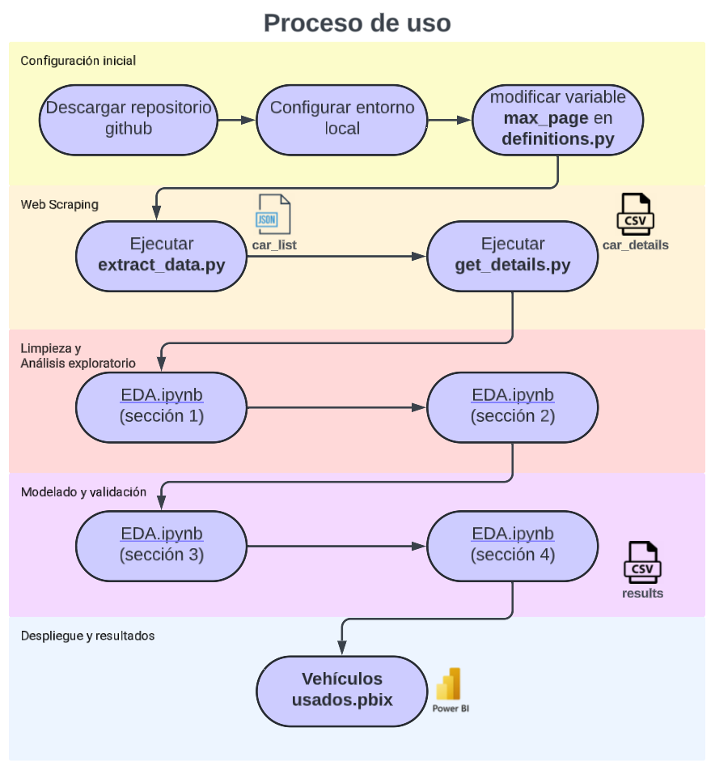
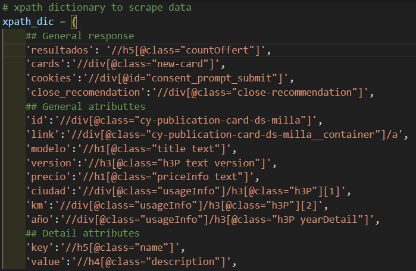
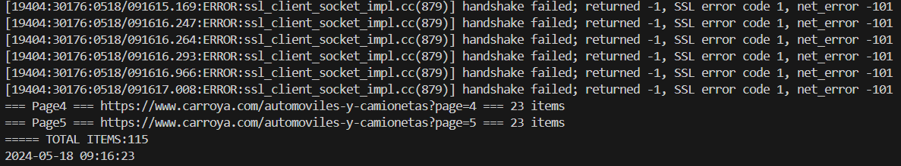
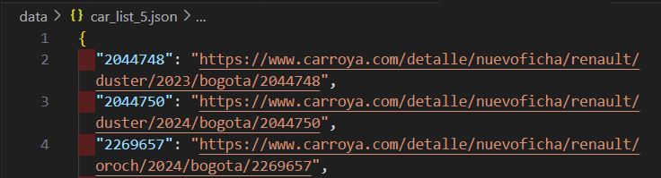

# WebScraping_CarroYa

[](LICENSE)

Este proyecto es un scraper de datos para la plataforma CarroYa. Permite obtener información de vehículos y realizar análisis sobre ellos. La estructura de las carpetas es la siguiente:

- **WebScraping_CarroYa:** Carpeta principal del proyecto.
- **src**: Carpeta que contiene los scripts principales del proyecto.
  - **definitions.py**: Archivo que contiene las definiciones de variables y xpath utilizadas en el web scraping.
  - **extract_data.py**: Script que descarga un archivo JSON con el ID y las URL de las páginas.
  -  **get_details.py**: Script que descarga la información detallada de cada URL de los vehículos y la almacena en formato CSV.
  - **EDA.ipynb:** Notebook de Jupyter utilizado para la limpieza de datos y el análisis exploratorio.
- **data**: Carpeta que contiene los archivos generados por los scripts.
  - **car_list_{max-pages}.json**: Archivo con la lista de ID y URLs de los vehículos.
  - **car_details.csv**: Archivo CSV con la información detallada de los vehículos.
- **img**: Carpeta que contiene las imágenes utilizadas en el archivo README.md.
- **pbi**: carpeta que contiene el archivo del power bi (tablero de los resultados).
- **quality**: Contiene el reporte de calidad de datos generado en html.
- **LICENSE**: Archivo de licencia GNU.
- **README.md**: Archivo de documentación principal del proyecto.

## Tabla de contenidos

- [WebScraping\_CarroYa](#webscraping_carroya)
  - [Tabla de contenidos](#tabla-de-contenidos)
  - [Instalación](#instalación)
  - [Configuración del entorno local](#configuración-del-entorno-local)
  - [Uso](#uso)
  - [Licencia](#licencia)

## Instalación

1. Clonar el repositorio.

    ```sh
    git clone https://github.com/masastoquec/WebScraping_CarroYa.git
    ```

2. Activar el entorno en Python.

   ```sh
    .\env\Scripts\activate
   ```

3. Instalar las dependencias.

    ```sh
    pip install -r requirements.txt
    ```

## Configuración del entorno local

- Instalar el driver de google chrome según las instrucciones de la siguiente página:  
  <https://developer.chrome.com/docs/chromedriver/get-started>
- Validar virtualenv: `pip install virtualenv`
- Crear entorno virtual: `virtualenv env`
- Activar el entorno: `.\env\Scripts\activate`
- Instalar librerías desde requirements.txt: `pip install -r .\requirements.txt`
- Desactivar el entorno: `deactivate`
- Crear o actualizar el archivo requirements.txt: `pip freeze > .\requirements.txt`

## Uso
En la siguiente imagen se resume el proceso de ejecución de lso scripts:


1. Modificar y guardar el archivo `.\src\definitions.py`.
  <br>Principalmente la variable `max_page = 5`, esta variable limita el web scraping a 5 paginas.
  <br> la variable xpath_dic contiene las definiciones del xpath de los atributos del DOM de la página, que se usar por el script para navegar sobre los elementos y extraer la información, si se quiere agregar variables o si en el futuro la página se actualiza, se deberá actualziar estas definiciones en formato xpath

    
2. Ejecutar el primer script, que descarga un archivo json con el id y las url de las páginas. 
   <br>Para que el código funcione correctemente a nivel de directorios debes estar ubicado en la raiz del proyecto

    ```sh
    python .\src\extract_data.py
    ```

    Se podrá ver el log de la ejecución en el terminal con información relevante del proceso

    

    Se creará un archivo con la lista de ID, URLs en `.\data\car_list_{max-pages}.json`.

    

3. Ejecutar el segundo script, que descarga la información detallada de cada una de las URL de los vehículos y los almacena en formato csv en el archivo `.\data\car_details.csv`.
    <br>¡Este proceso puete tomar demasiado tiempo dependiendo de la cantidad de items!
    <br>Como referencia, el proceso de descarga de 100 items demoró 6 minutos 19 segundos. pero esto puede fluctuar, dependiendo de la conexión a internet, demoras en la respues y algúnos métodos de bloqueo que generan que no se cargue la página y se tenga que reintentar el proceso.

    ```sh
    python .\src\get_details.py
    ```

4. Limpieza de los datos y EDA, este proceso lo vamos a realizar desde el notebook de jupyter `.\src\EDA.ipnyb`

## Licencia

Distribuido bajo la Licencia GNU. Consulta `LICENSE` para más información.
