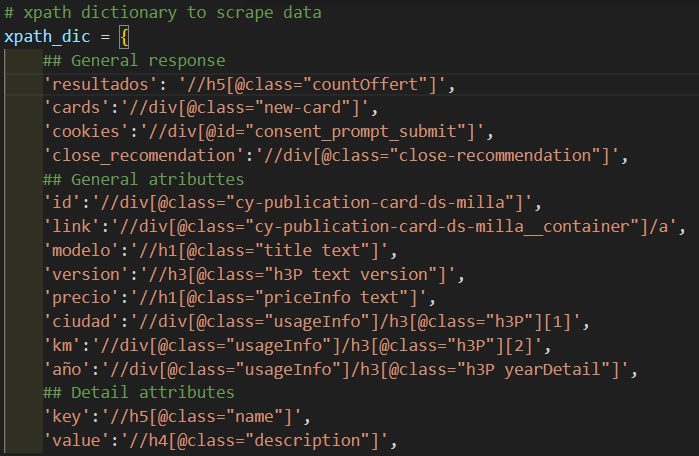
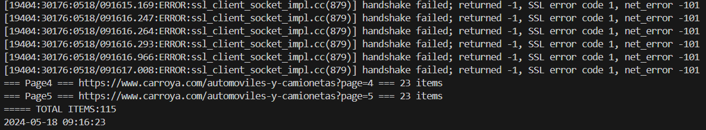
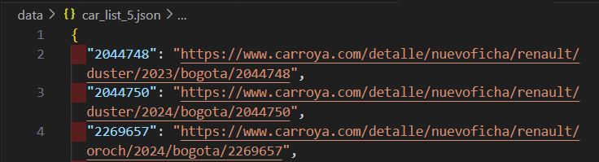

# WebScraping_CarroYa

[](LICENSE)

Este proyecto es un scraper de datos para la plataforma CarroYa. Permite obtener información de vehículos y realizar análisis sobre ellos.

## Tabla de contenidos

- [WebScraping\_CarroYa](#webscraping_carroya)
  - [Tabla de contenidos](#tabla-de-contenidos)
  - [Instalación](#instalación)
  - [Configuración del entorno local](#configuración-del-entorno-local)
  - [Uso](#uso)
  - [Licencia](#licencia)

## Instalación

1. Clonar el repositorio.

    ```sh
    git clone https://github.com/masastoquec/WebScraping_CarroYa.git
    ```

2. Activar el entorno en Python.

   ```sh
    .\env\Scripts\activate
   ```

3. Instalar las dependencias.

    ```sh
    pip install -r requirements.txt
    ```

## Configuración del entorno local

- Instalar el driver de google chrome según las instrucciones de la siguiente página:  
  <https://developer.chrome.com/docs/chromedriver/get-started>
- Validar virtualenv: `pip install virtualenv`
- Crear entorno virtual: `virtualenv env`
- Activar el entorno: `.\env\Scripts\activate`
- Instalar librerías desde requirements.txt: `pip install -r .\requirements.txt`
- Desactivar el entorno: `deactivate`
- Crear o actualizar el archivo requirements.txt: `pip freeze > .\requirements.txt`

## Uso

1. Modificar y guardar el archivo `.\src\definitions.py`.
  <br>Principalmente la variable `max_page = 5`, esta variable limita el web scraping a 5 paginas.
  <br> la variable xpath_dic contiene las definiciones del xpath de los atributos del DOM de la página, que se usar por el script para navegar sobre los elementos y extraer la información, si se quiere agregar variables o si en el futuro la página se actualiza, se deberá actualziar estas definiciones en formato xpath

    
2. Ejecutar el primer script, que descarga un archivo json con el id y las url de las páginas.

    ```sh
    python .\src\extract_data.py
    ```

    Se podrá ver el log de la ejecución en el terminal con información relevante del proceso

    

3. Se creará un archivo con la lista de ID, URLs en `.\data\car_list_{max-pages}.json`.

    

## Licencia

Distribuido bajo la Licencia GNU. Consulta `LICENSE` para más información.
